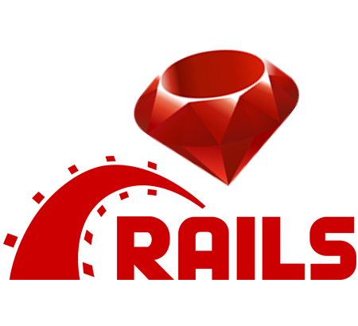
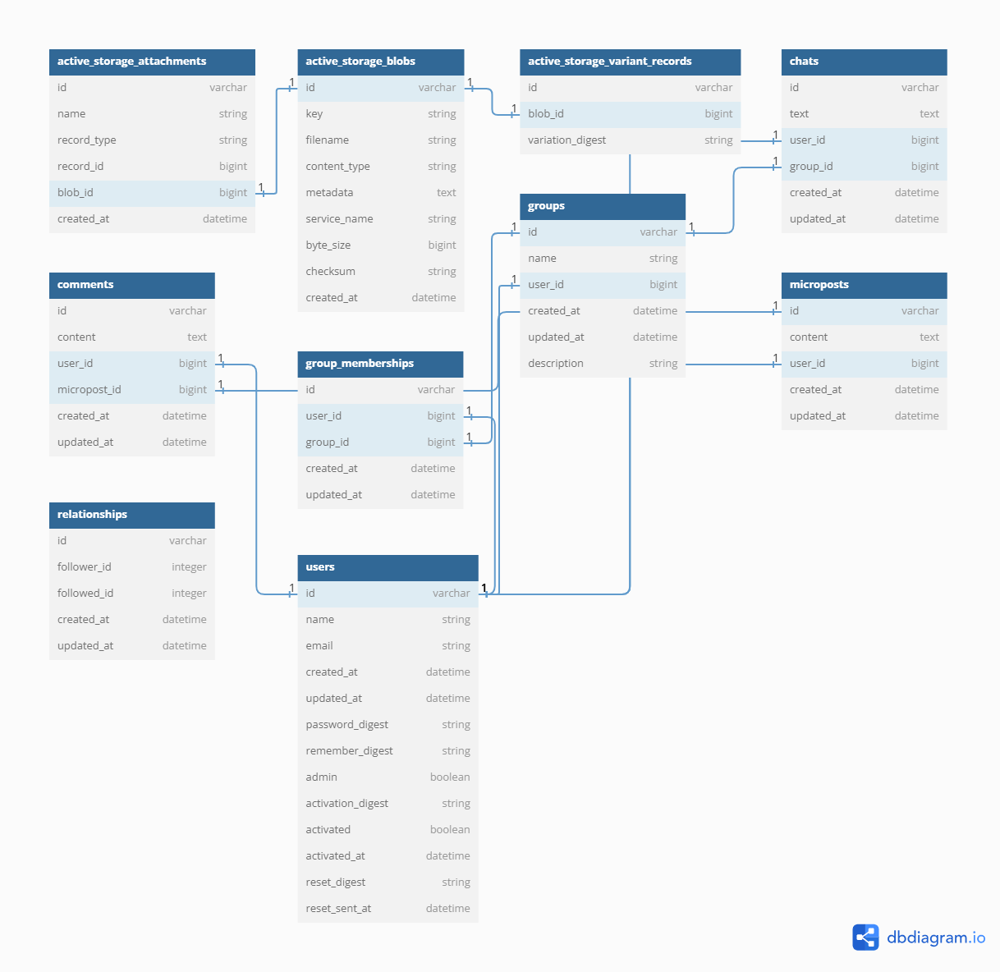
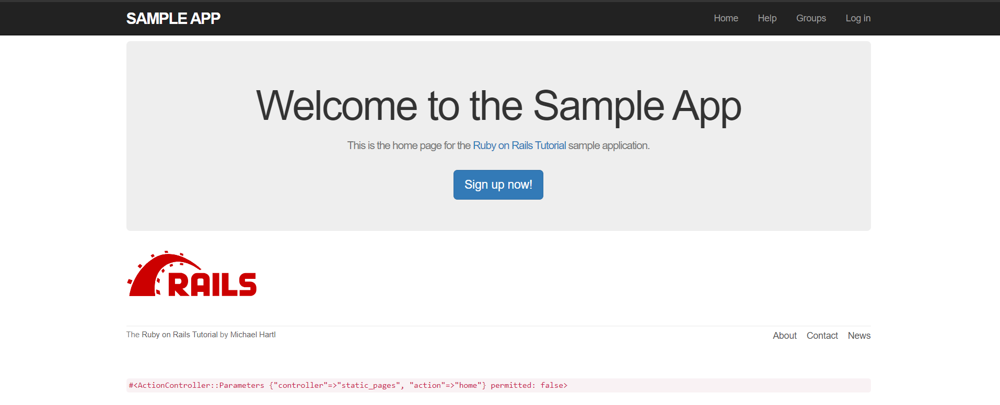
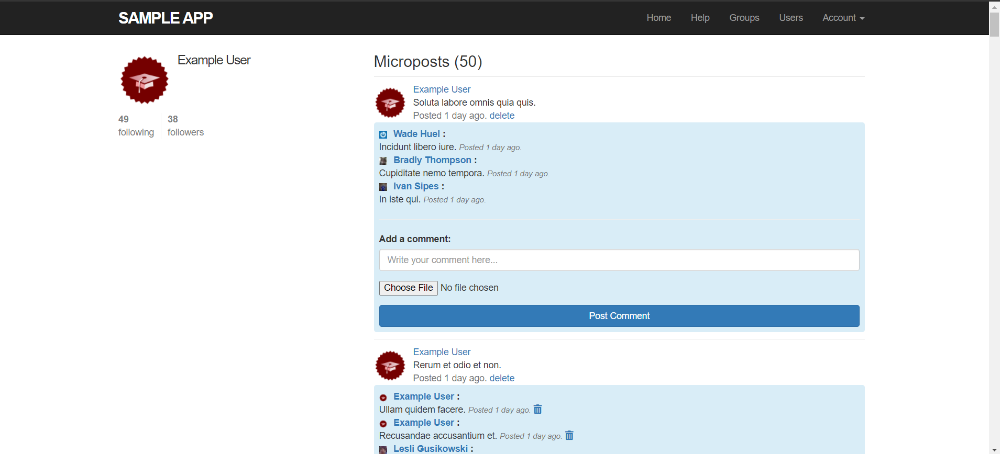
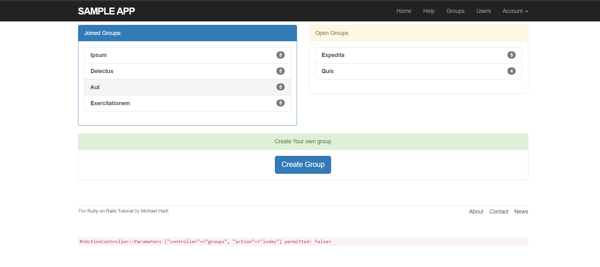

# README

Welcome to the Ruby on Rails Demo Project!

This project is a simple web application built using Ruby on Rails. It is hosted at [Ruby on Rails Demo](https://ruby-rails-demo.onrender.com/).

## How to Run the Project

To run the project locally, follow these steps:

1. **Set up Docker Desktop**: Make sure you have Docker Desktop installed on your machine. You can download it from [here](https://www.docker.com/products/docker-desktop).

2. **Clone the Project**: Clone this repository to your local machine using the following command:

   ```bash
   git clone <repository-url>
   ```

3. **Create `master.key` File**: In the `/config/` folder of the project, create a file named `master.key` if it doesn't exist already. Paste the following key into the file:

   ```
   5a2fd5b65a9584778405398c15fea8b9
   ```

4. **Run the Database Migration**: Execute the following command to create the database:

   ```bash
   docker-compose run --rm web bundle exec rails db:create
   ```

5. **Start the Application**: After setting up the database, you can start the Rails server by running:

   ```bash
   docker-compose up
   ```

6. **Seed the DB**: After setting up the database, you can populate the DB with data by running:

   ```bash
   docker-compose exec web bash rails db:seed
   ```

7. **Start the application on local server**: You can start the Rails server by running:

   ```bash
   docker compose exec web bin/rails s -b 0.0.0.0
   ```

Visit [http://localhost:3001](http://localhost:3001) in your web browser to view the application.

That's it! You now have the Ruby on Rails Demo project up and running locally on your machine.

## Ruby on Rails Demo Project



## Uml Diagram



## Homepage



## Mircroposts



## Groups


